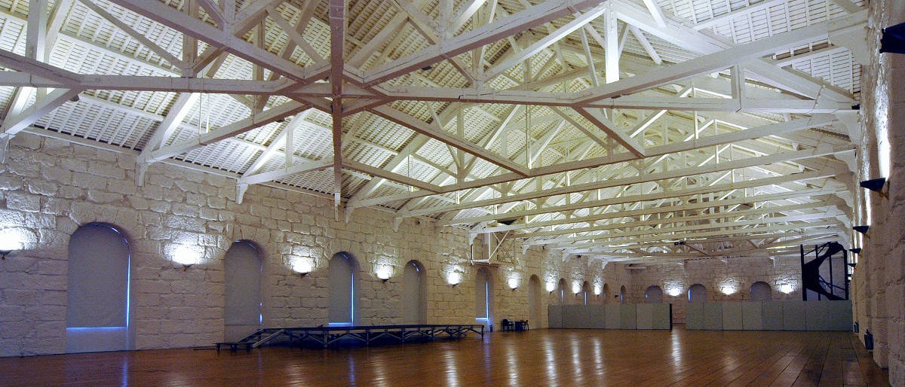

 

Na LCD Agenda procuramos divulgar eventos no Porto e arredores sobre temáticas que interessam à Comunidade do LCD Porto.

Focamos-nos portanto em Fabricação Digital, Instalações Intercativas e toda a multiplicidade de disciplinas que servem de base como programação, design, eletrónica, microcontroladores, etc., etc..

Vê mais abaixo como podes adicionar ao teu calendário ou sugerir mais eventos.

### Ainda este fim-de-Semana

#### Sábado

* [Docker Birthday #6: How do YOU #Docker? [Docker Porto]]
(https://www.meetup.com/Docker-Porto/events/259221693)
@ [Mindera](https://mindera.com/)
([mapa](https://goo.gl/maps/QRzJqBng38S2))
 <small>
Show-and-tell: Presentations sharing how do they Docker - Tiago Batista - Gabriel Pinto - Tiago Pires
</small>

* [Workshop Farfetch | Batismos de Programação @Happy Code Porto]
(https://www.eventbrite.pt/e/bilhetes-workshop-farfetch-batismos-de-programacao-happy-code-porto-58127975339)
@ [Farfetch](https://www.farfetch.com/pt/careers#10003)
([mapa](https://goo.gl/maps/sVqrgbSqpsH2))
 <small>
Venham conhecer a Happy Code, e a uma nova metodologia de ensino de programação através da participação num batismo de programação! O workshops têm duração de 1 hora, e permitem mostrar aos alunos o potencial da programação.
</small>

### Esta semana

#### Quarta a Sexta-Feira

 
### [typeof - web craftsmanship conference](https://typeofconf.com/)
@ Alfândega do Porto
([mapa](https://goo.gl/maps/25TX9JpyuEx))
 <small>
typeof is a professional frontend and web technologies conference. The inaugural edition is taking place in Porto on 28th and 29th of March, hosting a single track of talks and workshops by top-notch international speakers.
</small>

#### Segunda-feira, 25 de Março

* [DSPT#51 - Genetic algorithms are music to my ears (Braga)]
(https://www.meetup.com/datascienceportugal/events/259620630/)
@ [Startup Braga](https://www.startupbraga.com/)
([mapa](https://goo.gl/maps/WsVGkvgM4Hy))
 <small>
Distinguishing sounds with deep learning by - Ricardo Pinto // Genetic Algorithms: in search of the missing solution by - Davide Carneiro
</small>

#### Terça-feira, 26 de Março

* **[LCD Porto - Laboratório Aberto]
(https://www.lcdporto.org/atividades/laboratorio-aberto)**
@ [LCD Porto](https://lcdporto.org/)
([mapa](https://goo.gl/maps/A65zj4ZXTrp))
 <small>
**O Laboratório Aberto é um espaço de encontro semanal para o desenvolvimento de projectos e experiências envolvendo tecnologia, ciência e arte. Assenta na livre partilha de informação e conhecimento e na colaboração espontânea entre participantes.**
</small>

* [Cibersegurança nas empresas, na indústria e nos negócios]
(https://www.eventbrite.pt/e/registo-ciberseguranca-nas-empresas-na-industria-e-nos-negocios-58639519381)
@ Faculdade de Ciências da Universidade do Porto
([mapa](https://goo.gl/maps/976njNkk7cR2))
 <small>
Este evento pretende alertar para os riscos em matéria de cibersegurança nas organizações e para o impacto das falhas de segurança e dos ciberataques no quotidiano a nível social, económico e organizacional.
</small>

* [Agile Pecha Kucha Night]
(https://www.meetup.com/Agile-Connect-Porto/events/259388201/)
@ [Nataxis](https://www.natixis.com)
([mapa](https://goo.gl/maps/vCAt1d7UgN22))
 <small>
A Pecha Kucha Night! (https://en.wikipedia.org/wiki/PechaKucha).
</small>

* [PWL #10 :: Concurrency & Consensus]
(https://www.meetup.com/Papers-We-Love-Porto/events/cmmfnqyzfbzb/)
@ [Blip](https://www.blip.pt/)
([mapa](https://maps.google.com/?cid=12241631696413520772))
 <small>
Conquering Concurrency in Erlang by Sasha Fonseca // The consensus is that we won't come to a consensus about consensus protocols by Tiago Caxias
</small>

### Quarta-feira, 27 de Março

* [Abordagem prática à automação colaborativa]
(https://www.eventbrite.com/e/registo-abordagem-pratica-a-automacao-colaborativa-porto-27-marco-2019-54116854970)
@ Palacio do Freixo
([mapa](https://goo.gl/maps/MVa42UUtCXr))
 <small>
Pela mão dos três líderes industriais SCHUNK, Infaimon e Universal Robots, esta jornada abordará os principais desafios da indústria 4.0 e apresentará soluções práticas que permitem às empresas automatizar seus processos de fabricação e serem mais competitivas. A Automação industrial ao alcance de todos: simples, flexível e acessível.
</small>

* [Security Meetup - [0x72] - The Meet]
(https://www.meetup.com/0xOPOSEC/events/259729950/)
@ [Blip](https://www.blip.pt/)
([mapa](https://maps.google.com/?cid=12241631696413520772))
 <small>
"How to transform security awareness into a product - an experimental approach" (EN) by Anett Stoica // "Configuration Management and Security with Salt" (EN/PT) by João Valente
</small>

* [IEEE Talk "O Impacto da Tecnologia" - Saúde]
(https://www.facebook.com/events/2194236937496315/)
@ [IEEE UP Student Branch](http://up.ieee-pt.org/)
([mapa](https://goo.gl/maps/LJwhFJjUnAn))
 <small>
Vamos procurar focar sobretudo a forma como a evolução tecnológica tem proporcionado um grande avanço nas mais variadas áreas da saúde.
</small>

* [Estão as escolas preparadas para a Autonomia e a Flexibilidade]
(https://www.eventbrite.pt/e/bilhetes-estao-as-escolas-preparadas-para-a-autonomia-e-a-flexibilidade-curricular-55780870084)
@ [Colégio EFANOR Pólo II](http://www.colegioefanor.pt/)
([mapa](https://goo.gl/maps/W9QYSQiVjjp))
 <small>
Estão as escolas preparadas para a Autonomia e a Flexibilidade Curricular? Como preparar/avaliar a mudança junto das escolas, dos professores e dos pais?
</small>

### Quinta-feira, 28 de Março

* [Emotional Intelligence at Work [REACTOR TALK]]
(https://www.eventbrite.com/e/reactor-talk-emotional-intelligence-at-work-tickets-57979691819)
@ [REACTOR](https://reactorhub.io/)
([mapa](https://goo.gl/maps/jHDyounA2Ds))
 <small>
We're excited to share with you 5 Emotional Intelligence strategies to calm and channel your inner Diva.
</small>

* [Porto PHP Meetup]
(https://www.meetup.com/Porto-PHP-Meetup/events/259498908/)
@ TBA
 <small>
Pushing PHP at scale
</small>

* [Python Porto]
(https://www.meetup.com/pyporto/events/255823524/)
@ [Blip](https://www.blip.pt/)
([mapa](https://maps.google.com/?cid=12241631696413520772))
 <small>
Ricardo Lafuente "Python hacks for data, graphics and more" // Rui Quintino "Jupyter Notebooks Tips & Tricks"
</small>

* [Porquê criar um plugin e dicas para o seu sucesso]
(https://www.meetup.com/WP-Porto/events/259755990/)
@ [Porto i/o](http://porto.io/) Seaside
([mapa](https://maps.google.com/?cid=5216069477065432958))
 <small>
Porquê criar um plugin? E quando? Em que circunstâncias? O que fazer com ele? Vale a pena pensar em gerar rendimento com esse plugin? Como fazer para que tenha sucesso?
</small>

### Sexta-feira, 29 de Março

* [Game Dev Meet Norte]
(https://www.meetup.com/GameDevMeetPorto/events/259870649/)
@ [Polo Zero](http://polozero.fap.pt/)
([mapa](https://maps.google.com/?cid=6452894895241246126))
 <small>
Neste meet teremos presente o Helder Pinto, artista de ambiente em jogos como Crysis, Overwatch e Under Siege, que virá apresentar o seu novo projecto, Europa
</small>

### Sábado, 30 de Março

* [Quarterly Meeting :: An introduction to Natural Language Processing]
(https://www.meetup.com/portoai-community/events/258817228/)
@ [UPTEC](http://www.uptec.up.pt/)
([mapa](https://goo.gl/maps/r4diU9UZgzT2))
 <small>
How to model textual data: Word Embeddings // Applied knowledge: from theory to code.
</small>

* [iOS Peer Lab Porto]
(https://www.meetup.com/iOS-Peer-Lab-Porto/events/mcvzsqyzfbnc/)
@ R da Torrinha 158
([mapa](https://goo.gl/maps/xuhdrxzhtjE2))
 <small>
Each session will have discussion topics, small projects or technologies to research on if needed.
</small>

---

## Falta aqui o teu evento?

Podes suregir algo que nos tenha escapado usa este [Google Form](https://docs.google.com/forms/d/e/1FAIpQLSd_lOqzaRXBpCmAbJ9ODMuWPgkLzaN4xABgRX6HXPpDSDUB7Q/viewform?usp=sf_link).

## Como podes adicionar ao teu calendário

Podes adicionar a LCD Agenda ao calendário que habitualmente usas, quase todos têm essa opção. Vê as instruções seguindo os links.

* [Google Calendar](https://support.google.com/calendar/answer/37100?co=GENIE.Platform%3DDesktop&hl=en)
* [Microsoft Outlook](https://support.office.com/en-us/article/Import-or-subscribe-to-a-calendar-in-Outlook-com-cff1429c-5af6-41ec-a5b4-74f2c278e98c)

O link que tens que usar é este:
 <small>
https://calendar.google.com/calendar/ical/jfig.net_0gpa7saiiduptpqg4fc3sq1f7c%40group.calendar.google.com/public/basic.ics
</small>
